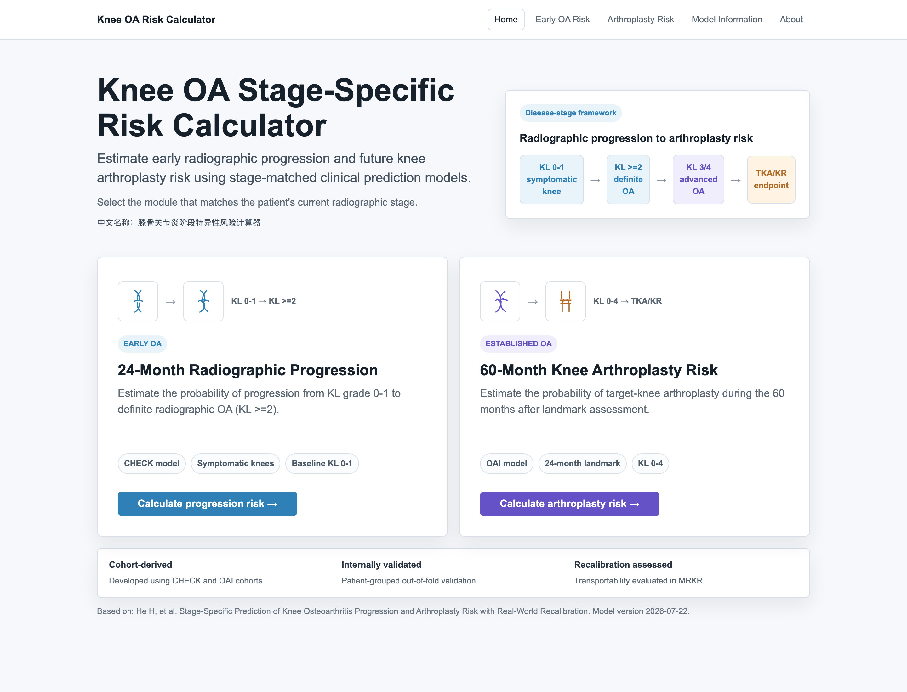
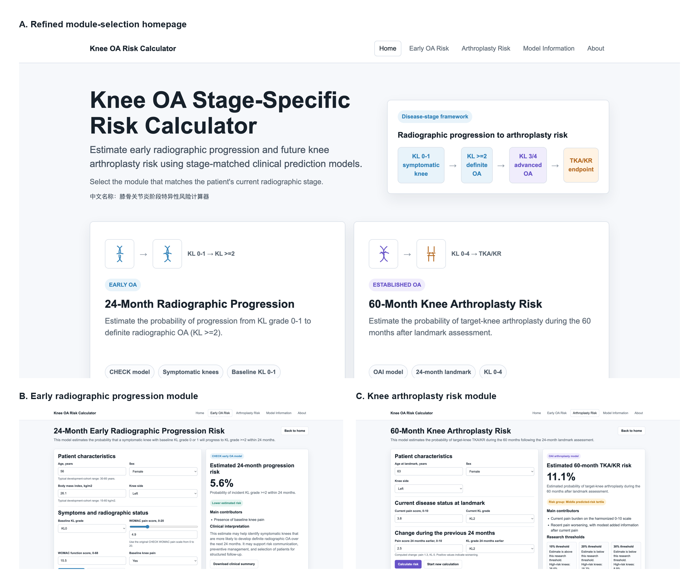

# Knee OA Stage-Specific Risk Calculator

**Online calculator:** [https://hang0418.github.io/oai-mrkr-model-f-core-risk-calculator/](https://hang0418.github.io/oai-mrkr-model-f-core-risk-calculator/)

<p align="center">
  <a href="https://hang0418.github.io/oai-mrkr-model-f-core-risk-calculator/">
    
  </a>
</p>

<p align="center">
  <a href="https://hang0418.github.io/oai-mrkr-model-f-core-risk-calculator/"><strong>Launch the online calculator</strong></a>
</p>

This repository accompanies the manuscript:

**Stage-specific prediction of knee osteoarthritis progression and arthroplasty risk with real-world recalibration**

It contains only manuscript figure/table assets, summary CSV tables, reproducibility scripts, and a static research-use web calculator. Raw CHECK, OAI, or MRKR source data are not included.

## Online calculator

The static calculator is served from `index.html` using GitHub Pages and implements two stage-matched modules:

- **Early Radiographic Progression**: 24-month risk of incident KL >=2 in symptomatic baseline KL0/1 knees.
- **Knee Arthroplasty Risk**: 60-month target-knee TKA/KR risk after the OAI 24-month landmark.

MRKR is represented as a model-transport and target-cohort recalibration page rather than as a patient-facing model-entry point.

## Calculator modules

| Module | Intended population | Prediction target | Development cohort |
|---|---|---|---|
| Early Radiographic Progression | Symptomatic knees with baseline KL grade 0 or 1 | 24-month incident KL >=2 | CHECK |
| Knee Arthroplasty Risk | Knees assessed at the OAI 24-month landmark across KL grades 0-4 | 60-month target-knee TKA/KR | OAI |

<p align="center">
  
</p>

## Repository structure

```text
index.html                  Static web calculator for GitHub Pages
figures/main/               Main manuscript figures
figures/supplementary/      Supplementary Figures S1-S14
tables/main/                Main manuscript tables extracted as CSV
tables/supplementary/       Supplementary Tables S1-S24 extracted as CSV after final consistency revision
scripts/                    Figure/table/calculator preparation scripts
screenshots/                Web-calculator screenshots used for Figure S14
```

## Use and limitations

The calculator is for research communication and reproducibility. It is not validated for treatment decisions or surgical eligibility. The threshold displays are exploratory and intended for risk enrichment, follow-up planning, and research use.

## Data availability

Only aggregate figure/table outputs are provided. Original cohort-level source data must be obtained through the relevant cohort data-access mechanisms.
## Submission asset source

The current figure and table assets were refreshed from the `投稿2` Word files: `Main Tables and Figure.docx` and `supplementary_materials.docx`. Only extracted figure images and CSV table summaries are included in this repository; the Word files themselves and raw cohort data are not uploaded.
